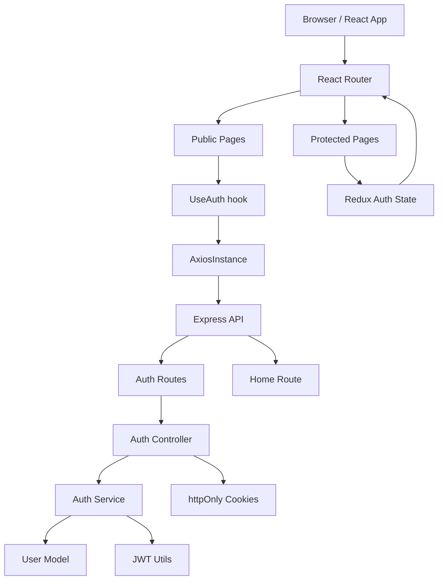
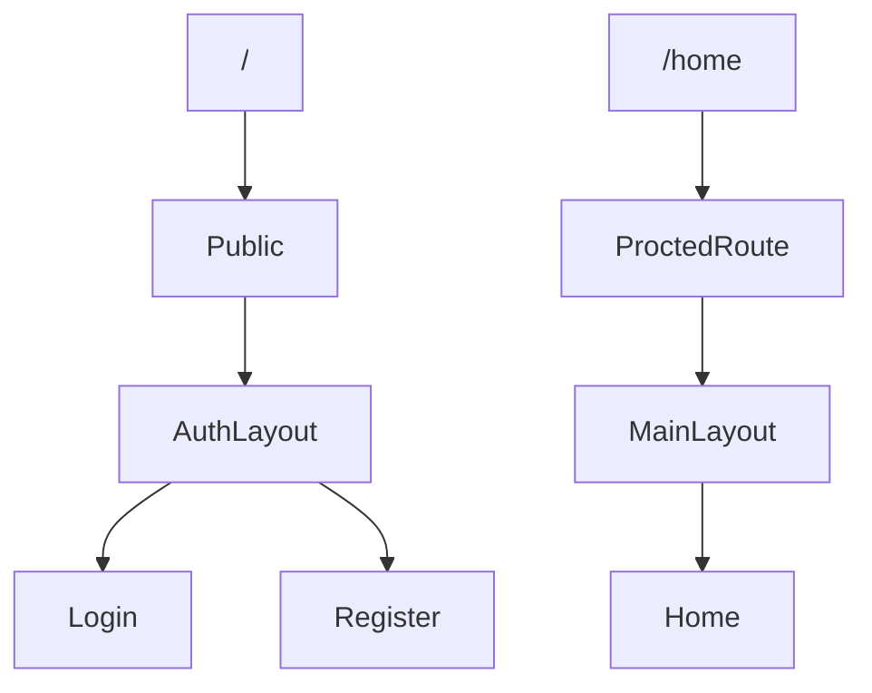
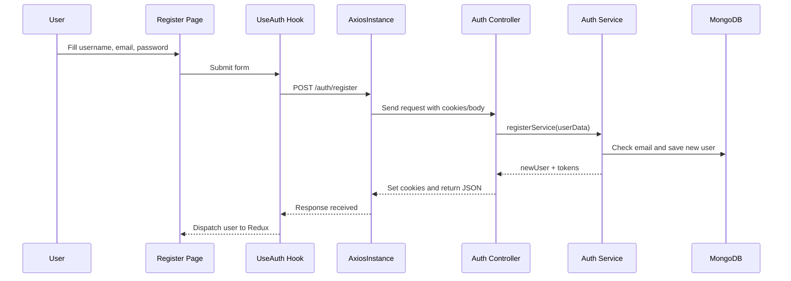
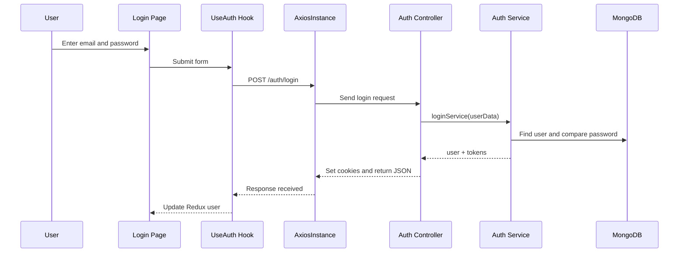
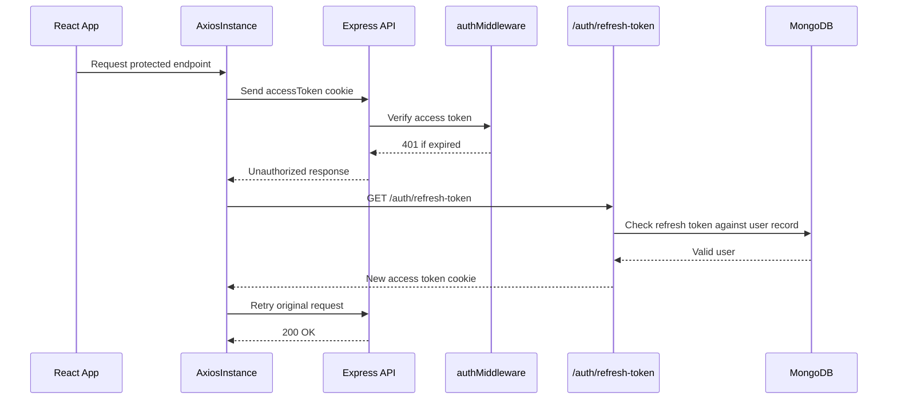
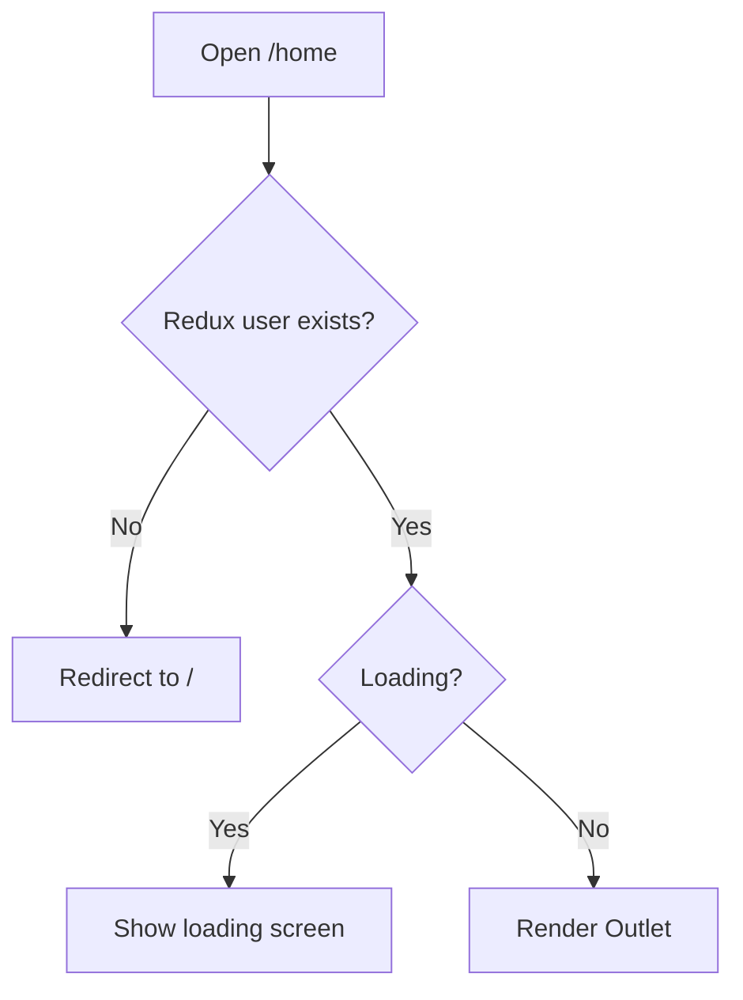
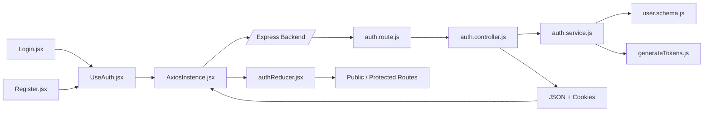
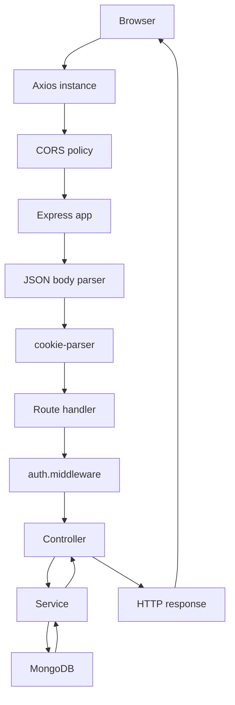

# Authentication System Documentation

This document explains the current authentication system in this repository as it is written today.
It is not a line-by-line code walkthrough. It is an architecture-level review that explains:

- what the system does
- how the frontend and backend communicate
- how login, register, protected routes, and token refresh work
- what is already good
- what is risky or missing
- what a production-ready version should look like

The codebase is split into a React frontend and an Express + MongoDB backend. The main goal is to let a user register, log in, stay logged in with cookies, and access protected pages without sending a password on every request.

## Table of Contents

- [1. Project Overview](#1-project-overview)
- [2. Folder Structure Explanation](#2-folder-structure-explanation)
- [3. Full Authentication Flow](#3-full-authentication-flow)
- [4. Access Token vs Refresh Token](#4-access-token-vs-refresh-token)
- [5. Diagram Section](#5-diagram-section)
- [6. Frontend Architecture](#6-frontend-architecture)
- [7. Backend Architecture](#7-backend-architecture)
- [8. Security Analysis](#8-security-analysis)
- [9. Best Practices](#9-best-practices)
- [10. Future Improvements](#10-future-improvements)
- [11. Mistakes in the Current Codebase](#11-mistakes-in-the-current-codebase)
- [12. Recommended Final Architecture](#12-recommended-final-architecture)
- [13. Final Summaries](#13-final-summaries)

## 1. Project Overview

This project is a small authentication system built with React on the frontend and Express + MongoDB on the backend.

It solves a very common problem:

- how to know who the user is
- how to keep the user logged in after a page refresh
- how to stop anonymous users from opening protected pages
- how to refresh the session when the short-lived access token expires

The system uses JWT tokens and httpOnly cookies.

Simple explanation:

- The backend creates tokens after login or register.
- The browser stores those tokens in cookies.
- The frontend checks the current session when the app starts.
- Protected pages only open when a valid user exists in Redux state.
- If the access token expires, the app tries to use the refresh token to get a new access token.

Why this design exists:

- It avoids storing passwords in the browser.
- It avoids putting tokens in localStorage, which is easier to steal with XSS.
- It lets the app restore login state after reloads.
- It separates short-term access from long-term session recovery.

### What this project is trying to become

At a high level, the codebase is aiming for this:

- React handles the UI and route guarding.
- Express handles request validation, token generation, and cookie handling.
- MongoDB stores users and the current refresh token.
- JWT access tokens prove the user is logged in.
- JWT refresh tokens let the app silently recover when the access token expires.

### What is already good

- Passwords are hashed with `bcrypt`.
- The code uses separate access and refresh tokens.
- Cookies are `httpOnly`, which is safer than storing tokens in JavaScript.
- The frontend uses one Axios instance with `withCredentials: true`.
- The backend uses middleware for protected routes.
- The code is already split into routes, controllers, services, middleware, models, utils, and hooks.

### What this is not yet

- It is not a full production auth platform yet.
- It does not have logout.
- It does not have role-based authorization.
- It does not have email verification.
- It does not have forgot-password flow.
- It does not have refresh token rotation.
- It does not have centralized error handling.

## 2. Folder Structure Explanation

### Backend structure

| Path | Purpose | Notes |
|---|---|---|
| `backend/server.js` | Starts the server and loads environment variables | Connects to MongoDB and listens on the port |
| `backend/src/app.js` | Creates the Express app | Adds CORS, JSON parsing, cookies, and routes |
| `backend/src/config/db.js` | MongoDB connection helper | Uses `MONGO_URI` from env |
| `backend/src/models/user.schema.js` | User database model | Stores username, email, password, refreshToken |
| `backend/src/utils/generateTokens.js` | JWT helper functions | Generates access and refresh tokens |
| `backend/src/services/auth.service.js` | Business logic for auth | Register, login, and refresh token logic |
| `backend/src/controllers/auth.controller.js` | HTTP layer for auth | Sets cookies and returns responses |
| `backend/src/middleware/auth.middleware.js` | Protects private routes | Verifies access token and loads the user |
| `backend/src/routes/auth.route.js` | Auth endpoints | Register, login, refresh, and me routes |
| `backend/src/routes/home.route.js` | Example protected route | Demonstrates middleware on a private route |
| `backend/package.json` | Backend dependencies | Express, bcrypt, jsonwebtoken, mongoose, cors, cookie-parser, dotenv |

### Frontend structure

| Path | Purpose | Notes |
|---|---|---|
| `frontend/src/main.jsx` | App entry point | Wraps the app in Redux Provider |
| `frontend/src/App.jsx` | Bootstraps session state | Calls `/auth/me` on first load |
| `frontend/src/routes/AppRoutes.jsx` | React Router tree | Separates public and protected sections |
| `frontend/src/routes/protected/Public.jsx` | Public route guard | Redirects logged-in users away from login pages |
| `frontend/src/routes/protected/ProctedRoute.jsx` | Protected route guard | Stops anonymous users from entering private pages |
| `frontend/src/layouts/AuthLayout.jsx` | Layout shell for auth pages | Uses `Outlet` for nested pages |
| `frontend/src/layouts/MainLayout.jsx` | Layout shell for app pages | Uses `Outlet` for nested pages |
| `frontend/src/config/AxiosInstence.jsx` | Axios API client | Sends cookies and tries refresh on auth failure |
| `frontend/src/state/authReducer.jsx` | Redux slice for auth | Stores `user` and `isLoading` |
| `frontend/src/app/store.jsx` | Redux store setup | Registers the auth reducer |
| `frontend/src/hooks/UseAuth.jsx` | Form + API helper hook | Handles login and register form submission |
| `frontend/src/pages/Login.jsx` | Login page | Email/password form |
| `frontend/src/pages/Register.jsx` | Register page | Username/email/password form |
| `frontend/src/pages/Home.jsx` | Protected dashboard page | Sample private page |
| `frontend/src/index.css` | Global CSS entry | Imports Tailwind |
| `frontend/package.json` | Frontend dependencies | React, Router, Redux Toolkit, Axios, React Hook Form, Tailwind |

### How the files communicate

The communication flow is simple:

1. A page like `Login.jsx` uses `UseAuth.jsx`.
2. `UseAuth.jsx` sends the request through `AxiosInstence.jsx`.
3. Axios sends cookies because `withCredentials: true` is enabled.
4. The request reaches the Express route in `auth.route.js`.
5. The route calls the controller in `auth.controller.js`.
6. The controller calls the service in `auth.service.js`.
7. The service reads or writes MongoDB through `user.schema.js`.
8. The controller sets cookies and returns JSON.
9. The frontend stores the user in Redux through `authReducer.jsx`.
10. Route guards like `Public.jsx` and `ProctedRoute.jsx` decide what page to show.

This is a good separation because each layer has one job.

## 3. Full Authentication Flow

This section explains the complete flow in simple steps and also explains why each step exists.

### 3.1 Registration flow

1. The user opens the register page.
2. The form collects `username`, `email`, and `password`.
3. The frontend sends those values to `POST /auth/register`.
4. The backend checks if all values exist.
5. The backend checks whether the email already exists.
6. The backend hashes the password using `bcrypt`.
7. The backend creates a new user document in MongoDB.
8. The backend creates an access token and a refresh token.
9. The backend stores the refresh token in the user document.
10. The backend sets both tokens as cookies.
11. The backend returns a response with the new user and tokens.
12. The frontend stores the user in Redux.
13. The public route sees that a user exists and redirects to `/home`.

Why each step happens:

- Validation happens first so bad data does not reach the database.
- Password hashing is required because passwords should never be stored in plain text.
- Tokens are generated so the user can stay logged in without typing the password again.
- The refresh token is stored on the server so the server can later verify that the session is still valid.

### 3.2 Login flow

1. The user enters email and password.
2. The frontend sends them to `POST /auth/login`.
3. The backend finds the user by email.
4. The backend compares the plain password with the stored hash.
5. If the password is correct, the backend creates new access and refresh tokens.
6. The refresh token is saved in the user document again.
7. Cookies are set on the response.
8. The frontend stores the user in Redux.
9. The public route redirects the user to `/home`.

Why each step happens:

- Email lookup finds the account.
- Password comparison proves that the person knows the secret.
- New tokens are created so the session can start fresh.
- Refresh token replacement makes the latest login the active session for that user.

### 3.3 App startup flow

When the app reloads, the browser forgets Redux state because Redux is in memory only.

To fix that, `App.jsx` calls `GET /auth/me` on startup.

1. The app mounts.
2. `App.jsx` sends a request to `/auth/me`.
3. Axios includes the cookies automatically.
4. The backend middleware reads the access token cookie.
5. If the access token is valid, the middleware loads the user from MongoDB.
6. The `/me` route sends the user back.
7. The frontend stores the user in Redux.
8. The route guards now know the user is logged in.

Why this step exists:

- Redux disappears on refresh.
- Cookies stay in the browser.
- The app needs a way to rebuild the user session after reload.

### 3.4 Protected route flow

Protected routes use `ProctedRoute.jsx`.

1. The route reads `user` from Redux.
2. If the app is still loading, it shows a loading screen.
3. If there is no user, it sends the browser back to `/`.
4. If a user exists, it renders the nested page with `Outlet`.

Why this step exists:

- Anonymous users should not enter private pages.
- The user should not see private content before the session is known.
- `Outlet` lets the route render child routes in a clean way.

### 3.5 Access token expiration flow

The access token only lasts 10 minutes.

That is intentional.

Why:

- Short-lived access tokens reduce risk if a token is stolen.
- A stolen access token is only useful for a small time window.

When the token expires:

1. The backend returns `401 Unauthorized`.
2. The Axios response interceptor catches the error.
3. It tries the refresh token endpoint.
4. The backend verifies the refresh token.
5. The backend issues a new access token.
6. The original request is repeated.

Why this works:

- The access token is short-lived.
- The refresh token is longer-lived.
- The refresh token acts like a backup key.

### 3.6 Refresh token flow

1. The frontend sends a protected request.
2. The access token is expired.
3. The backend rejects the request.
4. Axios tries `/auth/refresh-token`.
5. The backend reads the refresh token cookie.
6. The backend verifies the refresh token signature.
7. The backend checks whether that token matches the one saved in MongoDB.
8. If both checks pass, a new access token is created.
9. The new access token is set as a cookie.
10. The original request is retried.

Why the DB check matters:

- A signed token alone is not enough.
- The database check lets the server revoke a refresh token by overwriting it.
- This is how the server keeps some control over sessions.

### 3.7 Logout flow

There is no logout endpoint in the current codebase.

That means the current system does not have a true server-side logout flow yet.

In a production version, logout should do all of this:

- clear access token cookie
- clear refresh token cookie
- remove the refresh token from the database
- remove the user from Redux

Why logout matters:

- The user should be able to end a session early.
- A lost device should not keep a refresh token until expiry.
- Server-side revocation makes the session safer.

## 4. Access Token vs Refresh Token

| Item | Access Token | Refresh Token |
|---|---|---|
| Main job | Prove the user can access protected APIs | Get a new access token when the old one expires |
| Lifetime in this project | `10m` | `1d` |
| Stored in cookie | Yes | Yes |
| Stored in DB | No | Yes, in `user.refreshToken` |
| Used often | Every protected request | Only when access token is expired |
| Security goal | Short exposure window | Session recovery |
| Risk if stolen | Short-term access | Longer-term session takeover |

### Why both are needed

If only access tokens existed, the user would have to log in again very often.
If only refresh tokens existed, every request would carry a long-lived secret, which is not ideal.

Using both gives a good balance:

- access token keeps requests simple and short-lived
- refresh token keeps the user logged in without constant password use

### How this project currently handles them

Current behavior:

- access token expires in 10 minutes
- refresh token expires in 1 day
- both are written as `httpOnly` cookies
- the refresh token is stored in MongoDB in plain text
- the refresh endpoint only creates a new access token
- the refresh token itself is not rotated on refresh

### Is the flow correct?

Partly yes.

What is correct:

- access and refresh tokens are separated
- access token is short-lived
- refresh token is checked on the server
- cookies are `httpOnly`

What still needs work:

- refresh token rotation is missing
- refresh token is stored in plain text
- token values are returned in JSON responses too
- cookie settings are not environment-aware
- logout is missing

### Recommended token approach

Use this idea in production:

- keep access tokens short
- rotate refresh tokens every time they are used
- store refresh tokens hashed, or store them in Redis
- clear tokens on logout
- never return token values in JSON unless there is a very specific reason

## 5. Diagram Section

### 5.1 High-level authentication architecture



### 5.2 Route nesting structure



### 5.3 Register flow



### 5.4 Login flow



### 5.5 Refresh token flow



### 5.6 Protected route flow



### 5.7 Frontend to backend communication



### 5.8 Request lifecycle



## 6. Frontend Architecture

### 6.1 React Router structure

The frontend uses nested routes to split public and private parts of the app.

Current route tree:

- `/` goes through `Public`
- `/` child route uses `AuthLayout`
- `/` shows `Login`
- `/register` shows `Register`
- `/home` goes through `ProctedRoute`
- `/home` child route uses `MainLayout`
- `/home` shows `Home`

Why this is good:

- public and private pages are separated
- layouts can be reused
- route guards are easy to read

### 6.2 Outlet flow

`Outlet` is how nested child routes render inside a parent layout.

In this project:

- `AuthLayout` renders the login/register content area
- `MainLayout` renders the private app shell
- `Public` and `ProctedRoute` wrap the route groups and decide whether the child page can render

This pattern is useful because the layout stays stable while the inner page changes.

### 6.3 Protected and public routes

`Public.jsx`

- checks Redux for a user
- if a user exists, it redirects to `/home`
- if not, it shows the auth pages

`ProctedRoute.jsx`

- checks Redux for a user
- if loading, it shows a loader
- if no user, it redirects to `/`
- if a user exists, it renders the private route

This is frontend authorization logic.
It is really an authentication gate, not a role-based permission system.

### 6.4 Redux flow

The Redux store is very small:

- `user`
- `isLoading`

How it works:

1. `App.jsx` sends `/auth/me` on startup.
2. If the session is valid, it dispatches `addUser`.
3. If the session fails, it dispatches `removeUser`.
4. `Public` and `ProctedRoute` read the Redux state to decide routing.

Why this works:

- route components can react to authentication state
- the UI does not need to query the backend on every render

### 6.5 Custom hook

`UseAuth.jsx` is the custom hook that bundles:

- form handling from `react-hook-form`
- navigation
- Axios calls for login and register
- Redux dispatching

Example of the current idea:

```js
async function onLogin(data) {
  dispatch(setLodading(true));
  const res = await AxiosInstance.post('/auth/login', data);
  dispatch(addUser(res.data.user));
}
```

Why a hook is used:

- it keeps the pages smaller
- login and register can reuse the same logic
- form submission stays in one place

### 6.6 Axios instance

`AxiosInstence.jsx` is the central API client.

It does three important things:

- sets the backend base URL
- enables `withCredentials` so cookies are sent
- tries to refresh the token when a request fails

Why this is useful:

- components do not need to repeat API settings
- every request uses the same auth behavior
- cookie-based auth works across frontend and backend

### 6.7 Form handling

The pages use `react-hook-form`.

That is a good choice because:

- it is lightweight
- it keeps form state simple
- it makes submit handling easier

But right now the forms do not include real validation rules.

That means:

- empty values can still be submitted
- the backend must handle most validation
- error messages are not very useful yet

### 6.8 How data moves in the frontend

Current frontend data flow:

1. User types in the form.
2. `react-hook-form` collects the values.
3. `UseAuth.jsx` sends the values to Axios.
4. Axios sends the request to the backend with cookies.
5. The backend returns the user.
6. Redux stores the user.
7. Route guards use the user state.
8. The app shows public or private pages depending on the state.

## 7. Backend Architecture

### 7.1 Express flow

The Express app in `backend/src/app.js` is built in layers:

1. `cors` runs first so the browser can talk to the API.
2. `express.json()` parses JSON request bodies.
3. `cookie-parser` reads cookies from the request.
4. `express.urlencoded()` handles form-encoded bodies.
5. Routes are mounted.

Why this order matters:

- routes need parsed bodies
- auth middleware needs parsed cookies
- CORS must be ready before the browser sends requests

### 7.2 Middleware order

Middleware is the bridge between the request and the final response.

In this codebase:

- global middleware runs first in `app.js`
- route middleware like `authMiddleware` runs on protected routes
- controller logic runs after middleware passes

This is the normal Express pattern.

### 7.3 Controllers

Controllers are the HTTP layer.

They are responsible for:

- reading the request body
- calling the service
- setting cookies
- returning the response

In this codebase, the auth controller handles:

- register response
- login response
- refresh token response

This is good separation because the service does not need to know about HTTP details.

### 7.4 Services

Services contain the business rules.

In `auth.service.js`, the logic includes:

- checking required fields
- finding existing users
- hashing passwords
- comparing passwords
- generating tokens
- saving refresh tokens
- verifying refresh tokens

This is the right place for business logic because it can be reused and tested more easily.

### 7.5 JWT generation

`generateTokens.js` creates the two token types.

Simple logic:

```js
jwt.sign({ id: userId }, process.env.JWT_SECRET_ACCESS, { expiresIn: "10m" })
jwt.sign({ id: userId }, process.env.JWT_SECRET_REFRESH, { expiresIn: "1d" })
```

Why this is good:

- the token payload is small
- the user id is enough to identify the session
- the secrets are stored in environment variables
- access and refresh secrets are separate

### 7.6 Cookie handling

The controller sets both tokens as cookies.

Why cookies are used:

- the browser can send them automatically
- httpOnly cookies are not readable by JavaScript
- this reduces the risk of token theft from XSS

Important detail:

- `httpOnly` helps against XSS token theft
- `httpOnly` does not fully solve CSRF

### 7.7 Database communication

MongoDB stores the user document.

The schema contains:

- `username`
- `email`
- `password`
- `refreshToken`
- timestamps

The database is used for two reasons:

- to store the user account
- to store the current refresh token for server-side session control

### 7.8 Request lifecycle on the backend

For a protected request, the backend does this:

1. Read the incoming request.
2. Parse JSON and cookies.
3. Run auth middleware.
4. Verify the access token.
5. Look up the user in MongoDB.
6. Put the user on `req.user`.
7. Run the controller.
8. Send the JSON response.

This is the standard request-response cycle for a protected Express API.

## 8. Security Analysis

### What is already strong

- Passwords are hashed with `bcrypt`.
- Tokens are stored in `httpOnly` cookies.
- Access tokens are short-lived.
- Refresh tokens are checked against the database.
- The backend does not depend on localStorage for auth.

### Security issues and risks

| Issue | Why it matters | Risk level | Better approach |
|---|---|---:|---|
| Cookies use `secure: true` all the time | Browsers refuse Secure cookies on plain HTTP | High in local development | Make `secure` depend on environment |
| No `sameSite` setting | Cookie behavior is not explicit | Medium | Set `sameSite` clearly for dev and prod |
| Tokens are returned in JSON | JavaScript can read them again | High | Return only sanitized user data |
| Full user document is returned | Password hash and refresh token can leak | High | Send a safe DTO, not the raw Mongo document |
| Refresh token stored in plain text | DB leak becomes session leak | High | Hash refresh tokens or store them in Redis |
| No refresh token rotation | Stolen refresh token stays valid until expiry | High | Rotate refresh token on every refresh |
| Refresh endpoint uses GET | It is better to use POST for token refresh | Medium | Use POST + CSRF protection strategy |
| No logout endpoint | Sessions cannot be revoked cleanly | Medium | Add server-side logout |
| No CSRF protection | Cookie auth can be abused by cross-site requests | Medium | Use CSRF defense where needed |
| No input validation schema | Bad data can reach services | Medium | Use Zod, Joi, or express-validator |
| Logs include sensitive values | Tokens and user data can leak into logs | High | Remove debug logs or use a safe logger |
| No centralized error handler | Error responses are inconsistent | Medium | Add one JSON error middleware |

### Cookie settings analysis

The controller currently uses:

- `httpOnly: true`
- `secure: true`
- `maxAge` for access and refresh cookies

This is partly correct.

What is missing:

- environment-based `secure`
- explicit `sameSite`
- clear production and development behavior

Why this matters:

- on localhost over HTTP, `secure: true` can break login
- in production, missing `sameSite` can make the policy unclear
- cookie policy should be chosen on purpose, not left to defaults

Recommended cookie idea:

```js
res.cookie("accessToken", accessToken, {
  httpOnly: true,
  secure: process.env.NODE_ENV === "production",
  sameSite: process.env.NODE_ENV === "production" ? "none" : "lax",
  maxAge: 10 * 60 * 1000,
});
```

### CSRF analysis

Because auth uses cookies, CSRF becomes important.

Simple explanation:

- if the browser sends cookies automatically, another site may try to trigger unwanted requests
- `httpOnly` does not stop this
- `sameSite` helps, but it is not always enough by itself

In a serious production app, add a full CSRF strategy if the app uses cookie-based auth across sites.

### Authorization analysis

The current code uses authentication checks, not role-based authorization.

That means:

- it can tell if the user is logged in
- it cannot yet tell if the user is admin, editor, or regular user

So the current logic is binary:

- logged in
- not logged in

There are no permissions yet.

## 9. Best Practices

### What good structure looks like

- keep routes thin
- keep business logic in services
- keep token utilities in one place
- keep route guards in route components
- keep API calls in one shared client
- keep user session state in one Redux slice

### Production-level improvements

- use environment-based config for URLs and cookie settings
- add a validation layer before services run
- return a safe user object instead of raw Mongo documents
- add centralized error handling
- add request logging with a proper logger
- add rate limiting to login and refresh endpoints
- add helmet for safer HTTP headers
- add logout and token revocation
- add refresh token rotation
- use feature-based folders when the app grows

### Code quality improvements

- rename typoed files and functions
  - `AxiosInstence` -> `AxiosInstance`
  - `ProctedRoute` -> `ProtectedRoute`
  - `UseAuth` -> `useAuth`
  - `setLodading` -> `setLoading`
  - `getAcessTookenService` -> `getAccessTokenService`
- remove unused imports
- remove debug `console.log`
- standardize response shapes
- use index routes where appropriate instead of empty string paths

## 10. Future Improvements

These are the most useful next features for this project:

| Feature | Why it helps |
|---|---|
| Role-based auth | Lets the app control what different users can do |
| Email verification | Confirms the email is real before activating the account |
| Forgot password | Lets users reset access safely |
| OAuth login | Adds Google/GitHub style login |
| Refresh token rotation | Makes stolen refresh tokens much less useful |
| Redis sessions | Makes token/session revocation faster and cleaner |
| Rate limiting | Protects login and refresh endpoints from abuse |
| Logger | Makes debugging and production support easier |
| Centralized error handling | Gives the frontend consistent error responses |
| API validation | Stops invalid data before it reaches the database |
| TypeScript migration | Prevents many typo and shape bugs |
| Logout endpoint | Lets the server revoke sessions properly |

### Why these matter

- role-based auth is needed once there are different user types
- email verification reduces fake accounts
- forgot password is expected in real products
- refresh token rotation is a major security upgrade
- Redis is useful when auth grows beyond one simple collection field
- TypeScript would help catch the current typo-heavy naming issues

## 11. Mistakes in the Current Codebase

This section is intentionally direct. These are the issues that matter most.

| File or area | Mistake | Why it is a mistake |
|---|---|---|
| `frontend/src/config/AxiosInstence.jsx` | Refresh condition uses `||` instead of a safe `&&` check | It can try refresh on errors that are not 401 |
| `frontend/src/config/AxiosInstence.jsx` | The interceptor uses the same Axios instance for refresh requests | It can recursively intercept its own refresh call |
| `frontend/src/config/AxiosInstence.jsx` | No guard for `error.response` being undefined | Network errors can crash the interceptor logic |
| `frontend/src/routes/protected/Public.jsx` | Loading state is not returned | The login page can flash before session check finishes |
| `backend/src/controllers/auth.controller.js` | Raw user objects are returned | Password hash and refresh token can leak |
| `backend/src/routes/auth.route.js` | `/me` returns `req.user` directly | Same data leak problem as above |
| `backend/src/middleware/auth.middleware.js` | Token and user are logged | Sensitive data can appear in logs |
| `backend/src/services/auth.service.js` | Refresh token is stored as plain text | DB compromise becomes session compromise |
| `backend/src/services/auth.service.js` | One refresh token field per user | Only one active session per user is supported |
| `backend/src/routes/auth.route.js` | No logout route exists | Sessions cannot be revoked cleanly |
| `backend/server.js` | Server starts listening before DB connection finishes | Startup failure handling is less clean |
| `backend/src/app.js` | Frontend origin is hard-coded | Not flexible for staging and production |
| `frontend/src/pages/Login.jsx` | Unused imports and unused dispatch | This is cleanup debt and a sign the page is not finished |
| `frontend/src/App.jsx` | `isLoading` is read but not used | Indicates incomplete bootstrap UI handling |
| `frontend/src/pages/Login.jsx` and `Register.jsx` | No real validation rules are attached | Empty or weak inputs can still be submitted |
| Route naming | Typos like `ProctedRoute` and `AxiosInstence` | Makes the code harder to read and maintain |

### Why the interceptor bug is especially important

The current Axios interceptor is the most dangerous logic bug in the frontend.

The problem is:

- it tries refresh on too many errors
- it can call the refresh endpoint again inside the refresh error path
- it does not clearly stop itself from retrying the refresh request

This can cause:

- repeated refresh calls
- confusing error behavior
- hard-to-debug auth failures

The fix is to:

- check for `401` safely
- use a separate Axios client for refresh
- skip refresh logic when the failing request is already the refresh endpoint
- use a clear `_retry` flag

Recommended pattern:

```js
if (error.response?.status === 401 && !originalRequest._retry && originalRequest.url !== "/auth/refresh-token") {
  originalRequest._retry = true;
  await refreshAxios.post("/auth/refresh-token");
  return AxiosInstance(originalRequest);
}
```

### Why the cookie configuration is a real issue

The code sets `secure: true` in development.

That is a problem because the app currently runs on `http://localhost`.

If the browser refuses to store the cookie, then:

- `/auth/me` fails
- protected routes do not restore session
- login seems broken even though the backend returned success

This is one of the most common auth bugs in cookie-based local development.

## 12. Recommended Final Architecture

The current structure is small and readable, but it will grow better if it becomes feature-based and more defensive.

### Recommended backend structure

```text
backend/
  src/
    app.js
    server.js
    config/
      db.js
    modules/
      auth/
        auth.route.js
        auth.controller.js
        auth.service.js
        auth.validation.js
        auth.middleware.js
        auth.tokens.js
        auth.constants.js
      user/
        user.model.js
        user.service.js
    middlewares/
      error.middleware.js
      rateLimit.middleware.js
    utils/
      logger.js
      cookieOptions.js
      asyncHandler.js
```

### Recommended frontend structure

```text
frontend/
  src/
    app/
      store.jsx
      router.jsx
    features/
      auth/
        authSlice.jsx
        authApi.jsx
        useAuth.jsx
        Login.jsx
        Register.jsx
    layouts/
      AuthLayout.jsx
      MainLayout.jsx
    routes/
      ProtectedRoute.jsx
      PublicRoute.jsx
    pages/
      Home.jsx
    config/
      axiosInstance.jsx
```

### Recommended production-ready auth flow

1. User opens the app.
2. The app boots session state with `/auth/me`.
3. Protected routes wait until the session check is complete.
4. Login and register send requests through a shared API client.
5. Backend validates data before any DB write.
6. Passwords are hashed.
7. Tokens are created.
8. Refresh token is stored securely.
9. Cookies are set with environment-aware security options.
10. Protected API calls use the access token cookie.
11. When the access token expires, the app refreshes the session once.
12. On logout, the server clears cookies and revokes the refresh token.

### Recommended server-side security flow

- validate input first
- authenticate with access token
- authorize based on roles when needed
- keep refresh token state server-side
- rotate refresh token on use
- log safely
- return only safe data to the frontend

## 13. Final Summaries

### Final architecture summary

This project already has the right building blocks for a clean authentication system:

- React handles the UI and route protection.
- Redux stores the current user session.
- Axios sends cookie-based requests and tries to recover expired sessions.
- Express handles auth endpoints and protected routes.
- MongoDB stores user accounts and the refresh token.
- JWT handles stateless access tokens and long-lived session recovery.

The architecture is good for a learning project and a small real app.
It is not yet production-ready because it still needs stronger security, better validation, logout, token rotation, and cleaner error handling.

### Final authentication lifecycle summary

1. User registers or logs in.
2. Backend validates credentials.
3. Password is hashed or compared.
4. Access token and refresh token are created.
5. Cookies are set.
6. Frontend stores the user in Redux.
7. Protected routes open.
8. Access token expires after a short time.
9. Axios tries to refresh the access token with the refresh cookie.
10. Backend verifies the refresh token against the database.
11. A new access token is issued.
12. Original request is retried.
13. Logout is still missing and should be added.

### Recommended next learning path

1. Learn stronger validation with Zod or Joi.
2. Learn secure cookie settings and CSRF protection.
3. Learn refresh token rotation and logout revocation.
4. Learn role-based authorization.
5. Learn centralized error handling in Express.
6. Learn logging and rate limiting for production.
7. Learn TypeScript so typo bugs become less likely.
8. Learn testing for auth flows, especially login, refresh, and protected routes.

---

If you want, the next useful step would be to turn this documentation into a polished `README.md` or to fix the auth bugs one by one using this doc as the implementation guide.
